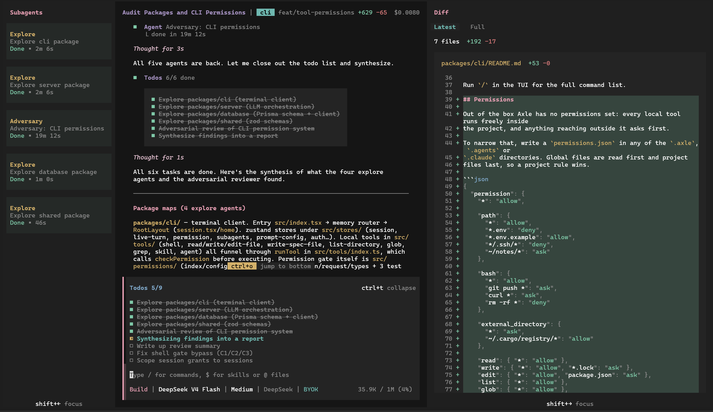

# Axle

My take on a terminal coding agent.



## Demo

Here is Axle fixing some errors on a simple c++ codebase for a 2d platform game. Recording is sped up 2x.


## Install

```bash
npm install -g @vm2/axle
```

Then run `axle` in any project directory.

Here are some access codes:

- 2V5J-Q86Q-KFVP
- WBPW-XYTX-F2K2
- 9D8N-YBTC-V8VW
- 8VGV-V2YJ-VUX5
- XK29-AZNQ-ZEAJ
- D4XX-E43X-N6US
- 57JY-6MNU-EHBK
- 56UR-9QRQ-ZE5D
- CVCD-EKDU-ZDE6
- ZY73-Z8UC-QUKV

Axle is currently in alpha. If the above codes do not work, email
[contact@vihangamihiranga.com](mailto:contact@vihangamihiranga.com) for an
invite code, then run `/login` on first start to redeem it.

## Highlights

- A curated list of models I vouch for with their OpenRouter equivalents.
- Includes the basic tools for editing files, a shell tool and a tool for web search+fetch.
- Sessions you can resume, plus `/undo` and `/redo` over edits made by a turn.
- Support for custom subagents and skills loaded from `.axle`, `.agents`, or `.claude`
  directories
- QOL features such as image and file attachments, themes, subagent and diff panel.

Run `/` in the TUI for the full command list.

## Permissions

Out of the box Axle has no permissions set. However, it will ask for permission
if it goes outside the current project directory.

If you wish to set up permissions, write a `permissions.json` in any of the `.axle`, `.agents` or
`.claude` directories. Project permissions will have higher priority over global permissions.

```json
{
  "permission": {
    "*": "allow",

    "path": {
      "*": "allow",
      "*.env": "deny",
      "*.env.example": "allow",
      "*/.ssh/*": "deny",
      "~/notes/*": "ask"
    },

    "bash": {
      "*": "allow",
      "git push *": "ask",
      "curl *": "ask",
      "rm -rf *": "deny"
    },

    "external_directory": {
      "*": "ask",
      "~/.cargo/registry/*": "allow"
    },

    "read": { "*": "allow" },
    "write": { "*": "allow", "*.lock": "ask" },
    "edit": { "*": "allow", "package.json": "ask" },
    "list": { "*": "allow" },
    "glob": { "*": "allow" },
    "grep": { "*": "allow" },
    "shell": { "*": "allow", "*--force*": "ask" },
    "skill": { "*": "allow", "deploy": "ask" },
    "agent": { "*": "allow", "reviewer": "deny" }
  }
}
```

Here, `path` applies to every file a tool touches, `bash` to each command in a chain,
`external_directory` to anything outside the project root, and the rest to one
tool each. 

`*` matches anything, and `~` means your home directory. For each surface, the
last matching rule takes priority, so put general rules first. Each surface is
checked separately, and the strictest result is used.

## Note

Alpha. Expect features and UI elements to move and break. Please report bugs or feature requests via `/issue`.
